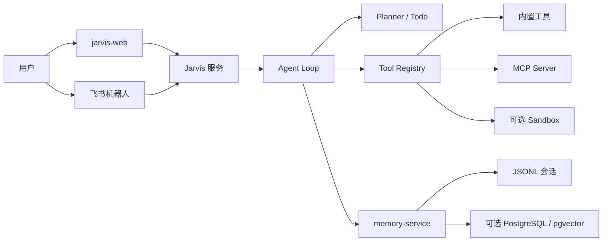

# Jarvis

[](https://openjdk.org/)
[](https://spring.io/projects/spring-boot)
[](https://react.dev/)
[](LICENSE)

Jarvis 是一个面向个人工作流的 Java AI Agent。它将对话、规划、工具执行、长期记忆和多渠道接入组织成独立模块，让用户能够通过 Web 或飞书，以自然语言完成代码仓库操作、文件处理、信息查询和自动化任务。

项目关注的不只是“模型能否回答”，还包括 Agent 在真实执行环境中的**上下文成本、工作目录边界、人工确认、会话可追溯性与可扩展工具接入**。

## 核心能力

| 能力 | 说明 |
| --- | --- |
| **Agent 执行循环** | 支持多轮工具调用、SSE 流式输出、Markdown 渲染、规划与 Todo 状态回传。 |
| **运行模式与 Token 治理** | 提供 `/chat`、`/agent`、`/super-agent` 模式；通过延迟工具暴露、上下文预算和大结果外置降低输入成本。 |
| **工具与 MCP** | 内置文件、Shell、Git、Cron、记忆、图片生成与飞书工具；兼容本地 `stdio` 和远程 `sse` MCP Server。 |
| **记忆服务** | 使用 JSONL 保存会话，提供 Working Memory、自动压缩、长期记忆提取和可选 PostgreSQL 向量检索。 |
| **Git 协作** | 支持状态、差异、提交、推送、Worktree 与任务状态管理；危险操作可要求人工确认后恢复执行循环。 |
| **安全执行** | 提供认证、工作目录路径校验、工具权限管理，以及可选的独立 HTTP Sandbox 服务。 |
| **接入方式** | 包含 React Web 客户端，并支持飞书机器人 WebSocket 长连接。 |

## 架构



## 快速开始

### 1. 准备环境

- JDK 21+
- Node.js 20+
- Docker（仅在启用 Sandbox 时需要）
- PostgreSQL（仅在启用用户、用量或向量存储时需要）

### 2. 克隆并创建本地配置

```bash
git clone https://github.com/zhantianshuai-dev/Jarvis.git
cd Jarvis

cp jarvis/src/main/resources/application-local.example.yaml \
  jarvis/src/main/resources/application-local.yaml
cp memory-service/src/main/resources/application-local.example.yaml \
  memory-service/src/main/resources/application-local.yaml
```

两个本地配置模板都会读取以下环境变量。最少需要提供：

```bash
export LLM_API_KEY=your_llm_key
export LLM_API_BASE=https://your-openai-compatible-endpoint
export LLM_MODEL=your_model_name
```

> [!TIP]
> 本地配置文件已被 Git 忽略。请不要将 API Key、数据库密码或飞书密钥写入默认 `application.yaml`。

### 3. 启动服务

依次启动记忆服务、Jarvis 后端和前端：

```bash
./mvnw spring-boot:run -pl memory-service -Dspring-boot.run.profiles=local
./mvnw spring-boot:run -pl jarvis -Dspring-boot.run.profiles=local

cd jarvis-web
npm install
npm run dev
```

打开 `http://127.0.0.1:5173`，注册账号后即可开始对话。默认端口如下：

| 服务 | 地址 |
| --- | --- |
| Web 客户端 | `http://127.0.0.1:5173` |
| Jarvis API | `http://localhost:8082` |
| Memory Service | `http://localhost:8081` |
| Sandbox Service（可选） | `http://localhost:8090` |

## 从一次提问到一次执行

1. 前端或飞书将用户消息投递到 Jarvis。
2. Jarvis 创建或恢复会话，加载系统提示、Working Memory 和已缓存的记忆快照。
3. Agent Loop 根据运行模式构造上下文并调用模型。
4. 模型需要执行操作时，由 `ToolRegistry` 校验并分发到内置工具或 MCP 工具。
5. 工具结果经过预算、截断或外置存储后回填循环，避免大文件和 `git diff` 长期占用上下文。
6. 最终回复和执行状态通过 SSE 持续推送到界面，同时会话消息持久化到 JSONL。

## 运行模式

| 模式 | 适用场景 | 工具策略 |
| --- | --- | --- |
| `/chat` | 问答、总结、普通对话 | 默认不暴露执行型工具，降低 Token 成本。 |
| `/agent` | 文件、Git、查询等明确操作 | 先暴露轻量工具；模型可通过 `tool_search` 延迟获取工具组。 |
| `/super-agent` | 多步骤、复杂任务 | 可使用更完整的工具集合，并根据复杂度生成计划和 Todo。 |

这种分层避免了简单问题反复携带大量工具 Schema；大工具和外部 MCP 仅在确实需要时进入下一轮模型请求。

## 上下文与记忆

Jarvis 将“会话记录”和“模型上下文”分开处理：

- **会话可追溯**：用户、助手和工具消息以 JSONL 保存，可在重新登录或刷新后恢复。
- **自动压缩**：会话 Token 接近阈值时，历史对话会归档并提取为 Working Memory，内存中保留摘要和近期消息。
- **语义记忆**：memory-service 可提取长期记忆；启用 PostgreSQL 后，支持向量检索与层级召回。
- **大结果外置**：超过预算的工具输出写入会话输出目录，模型仅收到摘要和引用，需要细节时再按范围读取。

## 工具、MCP 与 Skills

### 内置工具

Jarvis 内置文件读写、目录读取、Shell、Git、Cron、记忆检索、图片生成、飞书历史消息等工具。所有工具统一经过 `ToolRegistry` 的参数校验、权限策略与生命周期 Hook。

技能说明放在 `workspace/skills/`，用于向模型注入特定任务的执行规范。可提交技能定义，但不要提交运行时产生的会话、任务和工作目录数据。

### MCP Server

本地 MCP 使用 `stdio`：Jarvis 启动子进程，并通过标准输入/输出完成 MCP JSON-RPC 握手与调用。

```yaml
jarvis:
  mcp:
    external-servers:
      - name: filesystem
        transport: stdio
        command: npx
        args:
          - -y
          - "@modelcontextprotocol/server-filesystem"
          - ./workspace
```

远程 MCP 使用 `sse`，可在配置中提供 URL 和请求头：

```yaml
jarvis:
  mcp:
    external-servers:
      - name: web-search
        transport: sse
        url: https://example.com/mcp/sse
        headers:
          Authorization: Bearer ${MCP_API_KEY}
```

## Git 与人工确认

Git 工具支持状态查看、差异摘要、提交、推送与 Worktree 管理。`diff` 默认返回统计信息，避免将完整补丁直接塞入上下文。

对于推送等高风险调用，`ToolPermissionManager` 会创建待确认任务并暂停当前执行状态。用户在界面确认后，Jarvis 恢复原有 Agent Loop，将实际执行结果继续回填给模型，而不是启动一条孤立的新流程。

## 任务终止与恢复

每次请求都会生成稳定的 `run_id`，并经历 `queued`、`running`、`waiting_confirmation` 等状态。运行快照持久化在工作区的 `runs/index.json`，刷新页面后前端可以重新查询状态；服务重启时，未完成的运行会被收敛为 `interrupted`，不会被误判为仍在执行。

```http
GET  /api/v1/chat/runs/{runId}
POST /api/v1/chat/runs/{runId}/interrupt
```

终止请求会级联取消 LLM 流、正在等待的并发许可、工具进程与该 Run 派生的子 Agent，同时撤销尚未执行的人工确认凭证和 checkpoint。SSE 以 `interrupted` 事件结束，已生成的部分内容保留，后续不再发送普通 `done` 事件。确认卡的“拒绝”会写入后端会话状态，因此页面刷新后仍保持不可再次执行。

## Sandbox（可选）

Jarvis 支持三种工具执行后端：

- `direct`：在宿主机直接执行，仅保留路径检查，不提供操作系统级隔离。
- `os` / `seatbelt`：macOS 原生 Seatbelt 沙箱，采用与 Codex 相同的 `/usr/bin/sandbox-exec` 策略执行方式。
- `http` / `docker`：将文件和命令调用转发到独立的 Docker `sandbox-service`。

默认后端为 `os`，适用于 macOS 本地开发。默认模式为 `workspace-write`：命令可以读取宿主文件，写入范围限制在当前工作区和系统临时目录，网络默认关闭；所有子进程继承同一策略。选择 OS Sandbox 但 Seatbelt 不可用时，Jarvis 会启动失败，不会静默降级为直接执行。Linux 或服务器部署应显式选择 `docker`。

```bash
export JARVIS_SANDBOX_BACKEND=os
export JARVIS_OS_SANDBOX_MODE=workspace-write
export JARVIS_OS_SANDBOX_NETWORK_ACCESS=false
./mvnw spring-boot:run -pl jarvis -Dspring-boot.run.profiles=local
```

只读检查可设置 `JARVIS_OS_SANDBOX_MODE=read-only`。需要下载安装依赖或访问远程 Git 时，可以显式设置 `JARVIS_OS_SANDBOX_NETWORK_ACCESS=true`，外部写操作仍由工具权限与人工确认机制控制。

使用 Docker Sandbox：

```bash
./mvnw package -pl sandbox-service -DskipTests
JARVIS_SANDBOX_HOST_ROOT=/Users/you/project \
  docker compose -f docker-compose.sandbox.yml up -d --build

export JARVIS_SANDBOX_BACKEND=docker
export JARVIS_SANDBOX_HOST_ROOT=/Users/you/project
./mvnw spring-boot:run -pl jarvis -Dspring-boot.run.profiles=local
```

宿主机目录会挂载到容器 `/workspace`；Jarvis 和 sandbox-service 都会拒绝越出该根目录的路径。Sandbox 用于缩小工具执行影响面，不能替代权限控制、密钥隔离和人工确认。

## 可选集成

- **飞书**：设置 `JARVIS_FEISHU_ENABLED=true` 并配置应用凭证后，Jarvis 以 WebSocket 长连接接收飞书事件，无需单独配置公网事件回调。
- **PostgreSQL**：设置 `MEMORY_SERVICE_POSTGRES_ENABLED=true` 后，memory-service 使用 PostgreSQL 进行向量数据等持久化能力；未启用时可仅使用 JSONL 会话能力。
- **多模型回退**：主模型兼容 OpenAI Chat Completions API，可按配置启用 SiliconFlow、百炼等回退 Provider。

## 评测

仓库提供低成本端到端评测基线，覆盖运行模式、路径边界、Git 延迟工具、人工确认、Planner/Todo 和上下文治理。评测使用独立工作区和内存会话替身，不会访问飞书、外部 MCP 或远程 Git。

```bash
./mvnw spring-boot:run -pl jarvis \
  -Dspring-boot.run.profiles=local,eval \
  -Dspring-boot.run.main-class=com.zhan.jarvis.eval.JarvisEvaluationApplication
```

报告会写入 `jarvis/evals/reports/<run-id>/`。使用 `JARVIS_EVAL_SCENARIOS` 指定场景，可用 `JARVIS_EVAL_RUNS_PER_SCENARIO` 调整重复次数。

## 开发

```bash
./mvnw compile
./mvnw test
./mvnw package -pl sandbox-service -DskipTests
cd jarvis-web && npm run build
```

项目结构：

```text
common/            共享 Prompt、HTTP 与基础配置
jarvis/            Agent 主服务：Loop、工具、认证、Channel、Git 与 Planner
memory-service/    会话、Working Memory、长期记忆与检索服务
sandbox-service/   可选的 HTTP 工具执行服务
jarvis-web/        React + Vite Web 客户端
workspace/skills/  可提交的技能定义
```

## 安全说明

- 不要提交 `application-local.yaml`、`.env`、密钥、令牌、会话数据或运行日志。
- 服务对外开放前应启用认证，并通过 `JARVIS_AUTH_ALLOWED_ORIGINS` 限制 Web 来源。
- Shell、Git、MCP 与飞书工具会产生真实副作用，只应授权给可信用户。
- 若密钥曾被推送到公共仓库，请立即在对应平台轮换。

## 参与贡献

欢迎提交 Issue 和 Pull Request。提交前建议执行：

```bash
./mvnw test
cd jarvis-web && npm run build
```

请在 PR 中说明修改目的、影响模块、测试结果，以及界面或 API 行为变更的截图、示例。

## 许可证

本项目基于 [MIT License](LICENSE) 开源。
